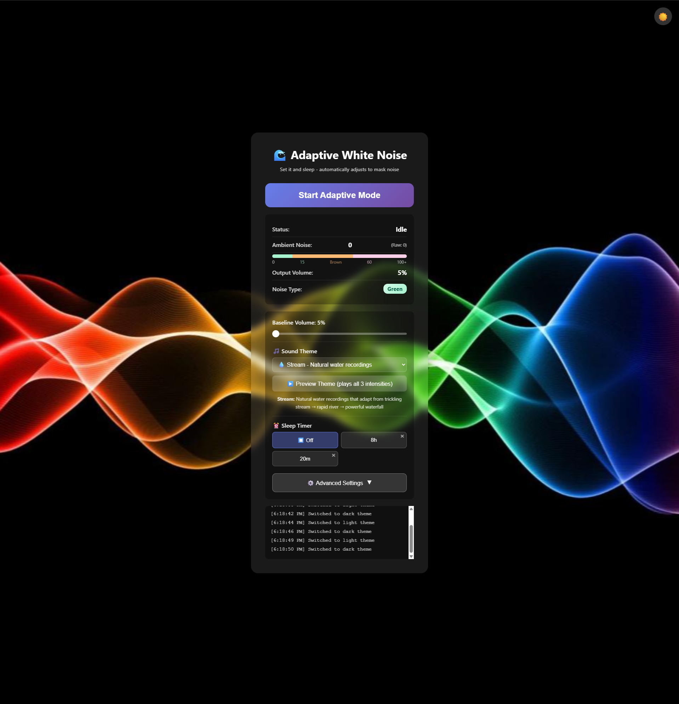

# 🌊 Adaptive White Noise

A smart, browser-based sound masking application that automatically adapts to your environment. Perfect for sleep, focus, and privacy.

<h3>🌙 Main Interface in Custom Dark Mode</h3>

<h3>☀️ Settings Panel in Custom Day Mode</h3>

## ✨ Features

### 🎵 Multiple Sound Themes
- **Adaptive Noise**: Synthesized noise that switches colors (White/Green/Brown/Pink) based on ambient noise type
- **Natural Recordings**: High-quality rain, ocean, and stream sounds with three intensity levels
- Real-time adaptation to ambient noise levels

### 🔊 Intelligent Volume Control
- **Automatic Adaptation**: Volume adjusts based on detected ambient noise
- **Three Intensity Levels**: Light, Medium, and Heavy sound profiles
- **Customizable Thresholds**: Set when sounds transition between intensities
- **Baseline Volume Control**: Set your preferred base volume level

### ⏰ Flexible Sleep Timer
- Multiple timer favorites (easily add custom durations)
- Default options: 8hr, 7hr, 6hr, 5hr, 4hr, 3hr, 2hr, 1hr, 30min, Off
- Countdown display shows remaining time
- Automatic stop when timer expires

### 🎨 Customization
- **Day/Night Themes**: Toggle between light and dark modes
- **Custom Backgrounds**: Upload your own images for each theme
- **Adjustable Transition Speeds**: Control fade-up, hold, and fade-down timing
- **Low Noise Behavior**: Choose what happens during quiet periods

### 🔒 Privacy & Offline
- **100% Browser-Based**: No server communication, all processing local
- **Works Offline**: Download and use without internet
- **No Data Collection**: Your settings stay on your device
- **Microphone Privacy**: Only used locally for noise detection, never transmitted

## 🚀 Quick Start

1. **Visit**: Simply open `adaptive-white-noise-themed6.html` in a modern web browser
2. **Grant Microphone Access**: Click "Start" and allow microphone access for adaptive features
3. **Adjust Settings**: Customize volume, theme, and timer to your preferences
4. **Save Preset**: Save your favorite configuration for quick access later

## 🎯 Use Cases

### 😴 Sleep
- Use Rain or Ocean themes with 8-hour sleep timer
- Adjust thresholds for gentle response to nighttime sounds
- Set fade-down speed to 5-10s for smooth transitions

### 🎯 Focus & Productivity
- Adaptive Noise mode masks distracting conversations
- Automatically adjusts to environmental changes
- Medium baseline volume with sensitive thresholds

### ✈️ Travel
- Ocean or Stream sounds mask hotel/flight noise
- Works offline - download before traveling
- Quick timer favorites for different situations

### 🏠 Privacy
- Mask conversations in shared spaces
- Adaptive mode responds to voice activity
- Higher baseline volume for consistent coverage

## 🛠️ Technical Details

### Browser Compatibility
- **Chrome/Edge**: Full support ✅
- **Firefox**: Full support ✅
- **Safari**: Full support ✅
- **Mobile Browsers**: Full support with touch controls ✅

### Requirements
- Modern web browser with Web Audio API support
- Microphone access (for adaptive features only)
- No installation or dependencies required

### How It Works
1. **Noise Detection**: Analyzes ambient sound using Web Audio API
2. **Intelligent Classification**: Determines appropriate sound intensity
3. **Smooth Transitions**: Applies volume changes with configurable fade speeds
4. **Persistent Settings**: All preferences saved to browser localStorage

## ⚙️ Settings Guide

### Basic Controls
- **Baseline Volume**: Your preferred volume level (5-60%)
- **Sound Theme**: Choose between Adaptive Noise or Natural Recordings
- **Sleep Timer**: Set automatic shutoff time

### Advanced Settings (Collapsible Panel)
- **Noise Thresholds**: Adjust when sounds switch between Light/Medium/Heavy
- **Transition Speeds**: Control fade-up, hold duration, and fade-down timing
- **Low Noise Behavior**: Off, Minimum Volume, or Keep Baseline
- **Custom Backgrounds**: Upload images for day/night themes

## 💡 Tips & Tricks

1. **First Time Setup**: Start with default settings and adjust gradually
2. **For Sleep**: Use longer fade-down speed (5-10s) for gentle transitions
3. **For Focus**: Use Adaptive Noise with medium sensitivity
4. **For Privacy**: Higher baseline volume with low sensitivity
5. **Timer Favorites**: Add your commonly used timer durations for quick access
6. **Background Images**: Use calming images that match your theme
7. **Low Noise Mode**: Try "Keep Baseline" if you want consistent background sound

## 📱 Mobile Usage

- Fully responsive design works on phones and tablets
- Touch-friendly controls for volume schedule editing
- Keep screen on during use (browser-dependent)
- Save to home screen for quick access

## 🔧 Troubleshooting

**Microphone access denied**: 
- App will still work with baseline volume
- To enable: Check browser permissions in settings

**No sound playing**:
- Check browser volume and system volume
- Ensure page has focus (click anywhere on page)
- Some browsers require user interaction before playing audio

**Settings not saving**:
- Check browser localStorage is enabled
- Clear browser cache and try again
- Incognito/Private mode won't persist settings

**Audio choppy or stuttering**:
- Close other audio-intensive browser tabs
- Try reducing browser tab count
- Restart browser

## 📄 License

This project is released under the **GNU Affero General Public License v3.0 (AGPL-3.0)**.

**What this means:**
- ✅ Free to use for anyone
- ✅ Free to modify and improve
- ✅ Must share modifications if you host it publicly
- ✅ Keeps the software free for everyone forever
- ❌ Cannot sell without providing source code
- ❌ Cannot hide modifications if hosting as a service

**Why AGPL?** This license ensures the app remains free and open for everyone. If someone hosts a modified version, they must share their improvements with the community.

See [LICENSE](LICENSE) for full details.

## 🤝 Contributing

This is a single-file HTML application for maximum simplicity and portability. If you'd like to suggest improvements:

1. Open an issue describing the enhancement
2. Fork the repository
3. Make your changes
4. Submit a pull request

## 🙏 Acknowledgments

- Natural sound recordings from Mixkit and Freesound.org
- Inspired by the need for better noise masking in shared workspaces
- Built with vanilla JavaScript for maximum compatibility

## ⭐ Support

If you find this useful, please consider:
- Starring the repository
- Sharing with others who might benefit
- Reporting bugs or suggesting features

## 📬 Contact

Questions, feedback, or suggestions? Open an issue on GitHub!

---

**Note**: This application requires microphone access only for the adaptive noise detection feature. The microphone is never recorded or transmitted - all processing happens locally in your browser.
